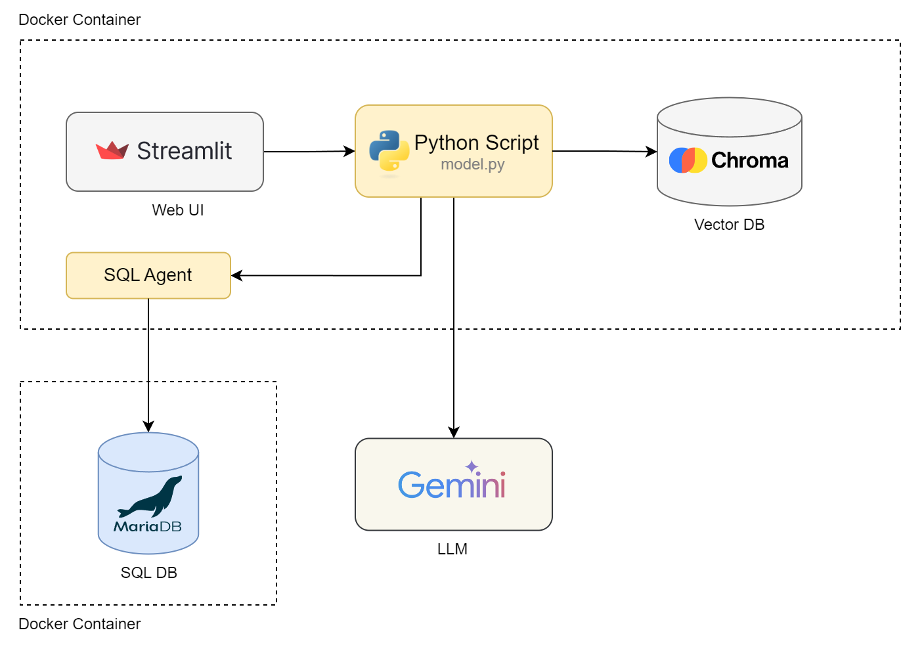

# DB-Chat

An end-to-end chat based app that enables users to talk to a database in natural language. To configure a custom database, please check the [Use custom database](#use-custom-database) section. 

## Table of Contents

* [Key Features](#key-features)
    * [Demo](#demo)
* [System Architecture](#system-architecture)
    * [Component Overview](#component-overview)
    * [Component Details](#component-details)
* [End-to-End Flow](#end-to-end-flow)
* [Deployment](#deployment)
    * [Docker Compose Deployment](#docker-compose-deployment)
    * [Use Custom Database](#use-custom-database)


## Key Features

- **Powerful Language Understanding**: Utilizes Gemini LLM for language comprehension.
- **Accurate Query Handling**: Chroma vector DB is utilized for few shot learning to help the LLM generate accurate SQL queries.
- **User-Friendly Interface**: Interactive and intuitive UI built with Streamlit.

### Demo

Watch the demo video below to see this app in action:

[db-chat-demo.webm](https://github.com/LostInCode404/db-chat/assets/15314796/10a84425-39f5-434d-a577-0c6946ad5189)

## System Architecture

### Component Overview

The system is composed of five main components:
1. **Gemini LLM**: Handles natural language processing and understanding. 
2. **Chroma Vector DB**: Stores and retrieves vector representations of the queries required for few shot learning.
3. **Agent**: Customized langchain's SQL Agent which utilizes the LLM and Chroma DB to generate responses.
4. **SQL Database**: Source of the data.
5. **Streamlit UI**: Provides an interface for users to submit queries and view results.

&nbsp;<br>


&nbsp;<br>

### Component Details

#### 1. Gemini LLM

The default model is `gemini-1.5-flash`, which is configurable in `.env` file. Custom prompts are being used to help the model generate accurate SQL queries and responses.

#### 2. Chroma Vector DB

Chroma DB is used as a vector store which indexes triplets of type `(question, sql query, answer)`. Whenever a user submits a query to the app, the vector store is queried for similar queries and the metadata is added to the prompt for top 5 matches. This helps the LLM generate accurate queries.

#### 3. Agent

This app uses langchain's SQL Agent with custom prompt augmented by the top 5 results from the vector store.

#### 4. SQL Database

This app uses uses `mariadb:11.4.2-noble` image for database by default. See [init.sql](./db/init.sql) for the database schema and data.

You can connect to the database using this command once it is running:
```
docker exec -it dbchat-db mariadb --database=dbchat --user=root --password=admin
```

#### 5. Streamlit UI

Streamlit UI takes the user input and uses the agent to generate results.


## End-to-End Flow
1. **User Input**: Users enter the query in the chat interface.
2. **Vector DB Lookup**: ChromaDB searches for similar queries and fetches top 5 matches.
3. **Prompt Generation**: Custom prompt is generated which includes the top 5 matching user queries (along with their correct SQL queries and responses) from vector DB.
4. **SQL Generation**: The LLM then reads the final prompt and interacts with the langchain's SQL toolkit to generate an SQL query that should fetch the data required for responding to the user query.
5. **LLM Response**: The LLM generates final response based on the results of the generated query.
6. **Chat Output**: The final LLM response is displayed to the user in chat interface.

## Deployment

#### Docker Compose Deployment 

```
# Start app
docker-compose up -d --build

# Stop app
docker-compose down
```

#### Use Custom Database

1. To use custom database, please specify the connection details in the `.env` file:

    ```sql
    SQL_HOST=localhost
    SQL_PORT=3306
    SQL_DB_NAME=dbname
    SQL_USERNAME=user
    SQL_PASSWORD=password
    ```
2. Update the few shot data file ([few-shot-data.json](./vector-db/few-shot-data.json`)). The required format:

    ```json
    [
        {
            "input": "Sample question 1",
            "query": "The correct sql query",
            "answer": "The answer"
        }
    ]
    ```
    If you want to use custom file, add it under `./vector-db` and update the file name property `FEW_SHOT_DATA_FILE` in `.env` file.

3. Run only the `app` service from docker compose.
